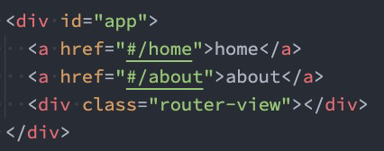
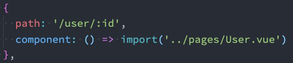
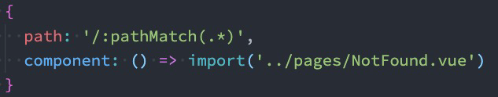
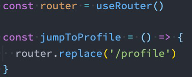

# vue-router

## 1. 路由 简介

### 1.1 认识前端路由

+ 路由的概念在软件工程中出现，最早是在后端路由中实现的，原因是web的发展主要经历了这样一些阶段：
  + 后端路由阶段；
  + 前后端分离阶段；
  + 单页面富应用（SPA）；

### 1.2 后端路由阶段

+ 早期的网站开发整个HTML页面是由服务器来渲染的.
  + 服务器直接生产渲染好对应的HTML页面, 返回给客户端进行展示.
  + 一个页面有自己对应的网址, 也就是URL；
  + URL会发送到服务器, 服务器会通过正则对该URL进行匹配, 并且最后交给一个Controller进行处理；
  + Controller进行各种处理, 最终生成HTML或者数据, 返回给前端.
+ 当我们页面中需要请求不同的路径内容时, 交给服务器来进行处理, 服务器渲染好整个页面, 并且将页面返回给客户端.这种情况下渲染好的页面, 不需要单独加载任何的js和css, 可以直接交给浏览器展示, 这样也**有利于SEO的优化.**
+ **后端路由的缺点**
  + 一种情况是整个页面的模块由后端人员来编写和维护的；
  + 另一种情况是前端开发人员如果要开发页面, 需要通过PHP和Java等语言来编写页面代码；
  + 而且通常情况下HTML代码和数据以及对应的逻辑会混在一起, 编写和维护都是非常糟糕的事情；

### 1.3 前后端分离阶段

+  **前端渲染的理解：**
  + 每次请求涉及到的静态资源都会从静态资源服务器获取，这些资源包括HTML+CSS+JS，然后在前端对这些请求回来的资源进行渲染；
  + 需要注意的是，客户端的每一次请求，都会从静态资源服务器请求文件；
  + 同时可以看到，和之前的后端路由不同，这时后端只是负责提供API了；
+ **前后端分离阶段：**
  + 随着Ajax的出现, 有了前后端分离的开发模式；
  + 后端只提供API来返回数据，前端通过Ajax获取数据，并且可以通过JavaScript将数据渲染到页面中；
  + 这样做最大的优点就是前后端责任的清晰，后端专注于数据上，前端专注于交互和可视化上；
  + 并且当移动端(iOS/Android)出现后，后端不需要进行任何处理，依然使用之前的一套API即可；
  + 目前比较少的网站采用这种模式开发（jQuery开发模式）；

### 1.4 单页面富应用（SPA）

​	一个路由对应一个组件

## 2. 路由的两种模式

### 2.1 hash

+ URL的hash也就是锚点(#), 本质上是改变window.location的href属性；
+ 我们可以通过直接赋值location.hash来改变href, 但是页面不发生刷新；
+ 

+ hash的**优势**就是兼容性更好，在老版IE中都可以运行，但是**缺陷**是有一个#，显得不像一个真实的路径。

### 2.2 history

+ history接口是HTML5新增的, 它有六种模式改变URL而不刷新页面：

  + replaceState：替换原来的路径；

  + pushState：使用新的路径；

  + popState：路径的回退；

  + go：向前或向后改变路径；

  + forward：向前改变路径；

  + back：向后改变路径；

+ 

## 3. 认识vue-router

安装：`npm install vue-router@4`

### 3.1 路由的使用步骤

+ 第一步：创建路由组件的组件；
+ 第二步：配置路由映射: 组件和路径映射关系的routes数组；
+ 第三步：通过createRouter创建路由对象，并且传入routes和history模式；
+ 第四步：使用路由: 通过<router-link>和<router-view>；

### 3.2 路由的默认路径

+ 在routes中又配置了一个映射：
  + path配置的是根路径: /
  + redirect是重定向, 也就是我们将根路径重定向到/home的路径下, 这样就可以得到我们想要的结果了.

### 3.3 模式切换

### 3.4 router-link

+ to属性：
  + 是一个字符串，或者是一个对象
+ replace属性：
  + 设置replace 属性的话，当点击时，会调用router.replace()，而不是router.push()；
+ active-class属性：
  + 设置激活a元素后应用的class，默认是router-link-active
+ exact-active-class属性：
  + 链接精准激活时，应用于渲染的<a> 的class，默认是router-link-exact-active

### 3.5 路由懒加载

当打包构建应用时，JavaScript 包会变得非常大，影响页面加载：

+ 如果我们能把不同路由对应的组件**分割成不同的代码块**，然后当路由被访问的时候才加载对应组件，这样就会更加高效；

+ 也可以**提高首屏的渲染效率**；

+ 其实这里利用的时webpack的分包知识，而Vue Router默认就支持动态来导入组件：

  + 这是因为component可以传入一个组件，也可以接收一个函数，该函数需要放回一个Promise；

  + 而import函数就是返回一个Promise；

  + 

  + 

    

    

    

### 3.5 动态路由的基本配置

很多时候我们需要将给定匹配模式的路由映射到同一个组件：

+ 例如，我们可能有一个User 组件，它应该对所有用户进行渲染，但是用户的ID是不同的；
+ 在Vue Router中，我们可以在路径中使用一个动态字段来实现，我们称之为路径参数；
+ 
+ 在router-link中进行如下跳转：
+ 

**获取动态路由的值**

+ 在template中，直接通过$route.params获取值；

+ 在created中，通过this.$route.params获取值；

+ 在setup中，我们要使用vue-router库给我们提供的一个hook useRoute；

  + 该Hook会返回一个Route对象，对象中保存着当前路由相关的值；

  

**匹配多个参数**

### 3.6 NotFound

对于哪些没有匹配到的路由，我们通常会匹配到固定的某个页面

比如NotFound的错误页面中，这个时候我们可**编写一个动态路由用于匹配所有的页面**；

我们可以通过**$route.params.pathMatch**获取到传入的参数：

**匹配规则加***

注意：在/:pathMatch(.*)后面又加了一个\*；

它们的区别在于解析的时候，是否解析/：

### 3.7 路由的嵌套

+ 目前我们匹配的Home、About、User等都属于底层路由，我们在它们之间可以来回进行切换；但是呢，我们Home页面本身，也可能会在多个组件之间来回切换：
  + 比如Home中包括Product、Message，它们可以在Home内部来回切换；
  + 这个时候我们就需要使用嵌套路由，在Home中也使用**router-view** 来占位之后需要渲染的组件；
+ 

### 3.8 代码的页面跳转

+ 有时候我们希望通过代码来完成页面的跳转，比如点击的是一个按钮：

  + 

+ 当然，我们也可以传入一个对象：

  + 

+ 如果是在**setup**中编写的代码，那么我们可以通过useRouter 来获取：

  + 

  

### 3.9 query方式的参数

在界面中通过**$route.query** 来获取参数：

### 3.10 replace

​	使用push的特点是压入一个新的页面，那么在用户点击返回时，上一个页面还可以回退，但是如果我们希望当前页面是一个替换操作，那么可以使用replace：

### 3.11 页面的前进后退

+ router的go方法：
+ 
+ router也有back：
  + 通过调用history.back() 回溯历史。相当于router.go(-1)；
+ router也有forward：
  + 通过调用history.forward() 在历史中前进。相当于router.go(1)；