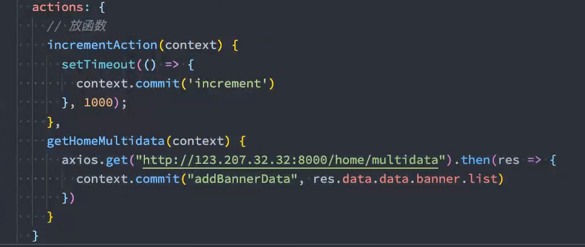

## 1. vuex的状态管理


+ 安装：`npm install vuex@next`

## 2. Vue devtool使用

+ vue其实提供了一个devtools，方便我们对组件或者vuex进行调试：
  + 我们需要安装beta版本支持vue3，目前是6.0.0 beta15；
+ 它有两种常见的安装方式：
  + 方式一：通过chrome的商店；
  + 
  + 方式二：手动下载代码，编译、安装；
    + https://github.com/vuejs/devtools/tree/v6.0.0-beta.15下载代码；
    + 执行yarn install 安装相关的依赖；
    + 执行yarn run build 打包；
    + 

## 3. Store

+ 每一个Vuex应用的核心就是store（仓库）：

  + store本质上是一个容器，它包含着你的应用中大部分的状态（state）；

+ **Vuex和单纯的全局对象的区别**

  + Vuex的状态存储是响应式的
    + 当Vue组件从store中读取状态的时候，若store中的状态发生变化，那么相应的组件也会被更新；
  + 不能直接改变store中的状态
    + 改变store中的状态的唯一途径就显示提交(commit) mutation；
    + 这样使得我们可以方便的跟踪每一个状态的变化，从而让我们能够通过一些工具帮助我们更好的管理应用的状态

+ 使用步骤：

  + 创建Store对象；

  + ```js
    import { createStore } from 'vuex'
    
    const store = createStore({
    	state() {
    		return {
    			count : 0,
    			name: '小明',
    			age: 23
    		}
    	}
    })
    
    export default store
    ```

  + 在app中通过插件安装；

  + ```js
    import { createApp } from 'vue'
    import App from './App.vue'
    import state from './store/index'
    
    createApp(App).use(state).mount('#app')
    ```

+ 在模板中使用

  + ```html
    <div>{{$store.state.count}}</div>
    ```

+ 在options api中使用，比如computed；

  + ```js
      computed: {
        sCount() {
          return this.$store.state.count
        }
      }
    ```

+ 在setup中使用

### mapState

+ options api 使用

  + ```js
    import { mapState } from 'vuex'
    
      computed: {
        sCount() {
          return this.$store.state.count
        },
          // vuex中的store属性
          // 1. 数组写法
        ...mapState(['name', 'age']),
        	// 2. 对象写法
        ...mapState({
          sname: (state) => {state.name}   // 返回一个函数，并传递state参数
        })
      },
    ```

+ 在setup中使用mapState

  + 默认情况下，Vuex并没有提供非常方便的使用mapState的方式，这里我们进行了一个函数的封装：
  + 

## 4. Getter

+ 某些属性我们可能需要经过变化后来使用，这个时候可以使用getters：


+ getters可以接收第二个参数：可以获取到其他的getter
  + 

+ getters中的函数本身，可以返回一个函数，那么在使用的地方相当于可以调用这个函数：
  + 

### mapGetters

+ options Api  ---  computed
  + 
+ setup
  + 
  + 

## 5. Mutation

+ 更改Vuex 的store 中的状态的唯一方法是提交mutation：
  + 
+ Mutation携带数据
  + 很多时候我们在提交mutation的时候，会携带一些数据，这个时候我们可以使用参数：
    + 
  + payload为对象类型
    + 
  + 对象风格的提交方式
    + 
+ Mutation常量类型
  + 定义常量：mutation-type.js
    + 
  + 定义mutation
    + 
  + 提交mutation
    + 
+ mapMutations辅助函数
  + 我们也可以借助于辅助函数，帮助我们快速映射到对应的方法中：
    + 
    + 
  + 在setup中使用也是一样的：
    + 
+ mutation重要原则
  + mutation 必须是同步函数
    + 这是因为devtool工具会记录mutation的日记；
    + 每一条mutation被记录，devtools都需要捕捉到前一状态和后一状态的快照；
    + 但是在mutation中执行异步操作，就无法追踪到数据的变化；
    + 所以Vuex的重要原则中要求mutation必须是同步函数；

## 6. Actions

+ Action类似于mutation，不同在于：
  + Action提交的是mutation，而不是直接变更状态；
  + Action可以包含任意异步操作；
  + 
+ 这里有一个非常重要的参数context：
  + context是一个和store实例均有相同方法和属性的context对象；
  + 所以我们可以从其中获取到commit方法来提交一个mutation，或者通过context.state 和context.getters 来获取state 和getters；
+ actions的分发操作
  + 分发使用的是store 上的dispatch函数；
    + 
  + 同样的，它也可以携带我们的参数：
    + 
  + 也可以以对象的形式进行分发：
    + 

### mapActions

+ options Api对象写法,数组类型的写法
  + 
+ setup对象写法,数组类型的写法
  + 

+ actions的异步操作
  + 可以通过让action返回Promise，在**Promise**的then中来处理完成后的操作；
  + 
  + 

## 7. Module

+ module的局部状态
  + 对于模块内部的mutation 和getter，接收的第一个参数是模块的局部状态对象：
  + 
+ module的命名空间
  + 默认情况下，模块内部的action和mutation仍然是注册在全局的命名空间中的：
    + 这样使得多个模块能够对同一个action 或mutation 作出响应；
    + Getter 同样也默认注册在全局命名空间；
    + 
  + 如果我们希望模块具有更高的封装度和复用性，可以添加namespaced: true 的方式使其成为带命名空间的模块：
    + 当模块被注册后，它的所有getter、action 及mutation 都会自动根据模块注册的路径调整命名；
    + 
  + 模块中getters 的参数---可以获取到root中的state和getters
    + 
  + 模块中actions的属性
    + 

+ module修改或派发根组件
  + 如果我们希望在action中修改root中的state，那么有如下的方式：
  + 

### module的辅助函数

+ 辅助函数有三种使用方法：
  + 方式一：通过完整的模块空间名称来查找；
    + 
  + 方式二：第一个参数传入模块空间名称，后面写上要使用的属性；
    + 
  + 方式三：通过createNamespacedHelpers 生成一个模块的辅助函数；
    + 

+ setup中使用   --->   对useState和useGetters修改
  + 
